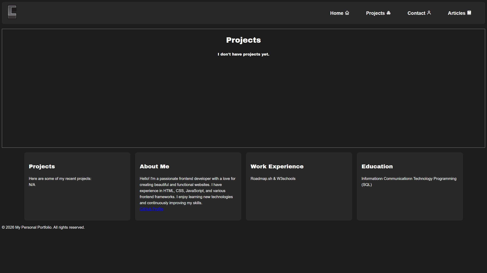

# Personal Profilio

#Submission Requirements
Your submission should include:

- [x] A fully styled, responsive website with the same structure as the previous project.

- [x] Consistent use of a chosen color scheme and typography.

- [x] Proper use of CSS techniques like Flexbox, media queries, and the box model.

- [x] A responsive navigation bar and well-styled contact form.

Bonus Points
For bonus points, you can:

- [x] Use Google Fonts to enhance the typography of your website.

